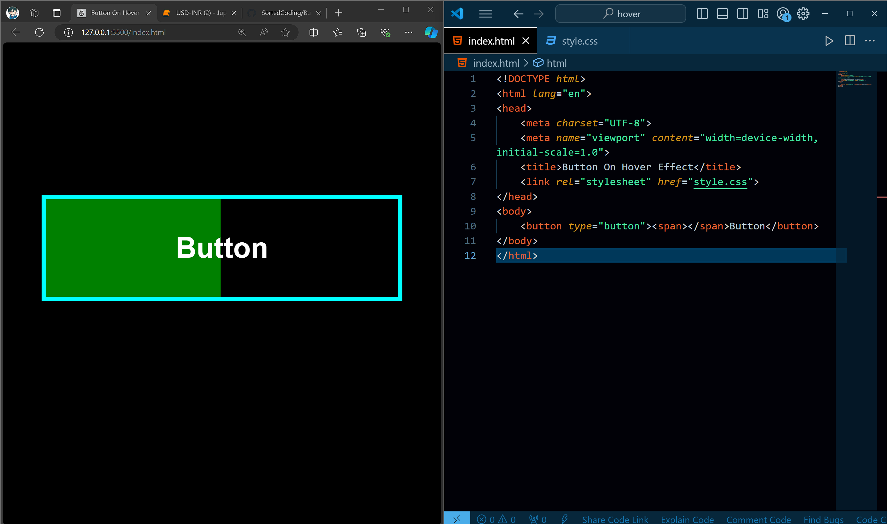

# On Hover Effect in HTML
A simple HTML repository demonstrating a basic on hover effect using CSS.

# Tutorial is available on youtube channel 
click on the link to see :- ([Open in Youtube]())

# Screenshot
Here we have project screenshot :

On Hover :

# Description
This repository contains an HTML file that showcases a simple on hover effect using CSS. When you hover over a specific element, the background color and text color change, creating a visually appealing effect.

# Features
Simple and easy to understand code
Basic on hover effect using CSS
Can be easily customized and extended

# Example Use Case
You can use this on hover effect in various scenarios, such as:

# Creating a navigation menu with hover effects
Adding visual interest to buttons or links
Enhancing the user experience with interactive elements

# Getting Started
Clone the repository: git clone https://github.com/your-username/on-hover-effect.git
Open the index.html file in your favorite browser
Hover over the element to see the effect in action!

# Contributing
Feel free to contribute to this repository by forking it and submitting a pull request. If you have any questions or need help, don't hesitate to ask!
